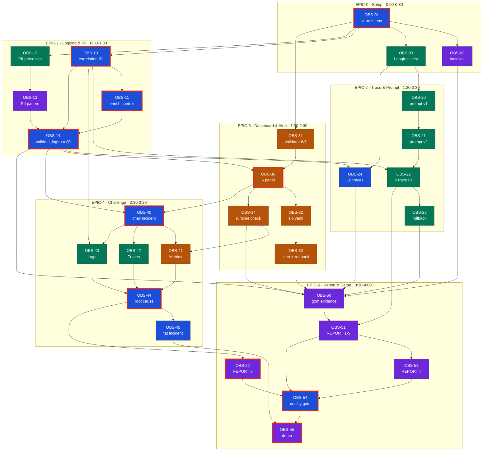

# Day 13 — Sprint Plan (Jira style)

Sprint: 4 giờ lab · Board: `OBS` · Spec kỹ thuật: [SPEC.md](SPEC.md) · Lý thuyết ôn vấn đáp: [THEORY.md](THEORY.md)

---

## 📌 Lưu ý ghim — đọc trước khi gõ dòng code đầu tiên

**Môi trường**

0. **Tạo `.venv` bằng Python 3.11** (`py -3.11 -m venv .venv`). Với Python 3.14,
   `pydantic==2.11.4` chưa có wheel dựng sẵn → pip cố build `pydantic-core` từ Rust và fail
   `linker link.exe not found` trên máy không cài Visual C++ Build Tools.
1. **`.venv` riêng từng máy, `.env` chung cả nhóm.** `.venv` chứa binary theo OS, không copy được,
   đã gitignore → cả 4 người tự tạo ở phút đầu, làm song song. Nội dung `.env` phải **giống hệt**
   trên 4 máy, nếu không trace bắn vào 4 project khác nhau và không gom đủ 10 trace.
   QUANG chốt `.env` sau `OBS-03`, phát qua chat nhóm — **không qua Git**.
2. Ai đổi `LANGFUSE_PROMPT_LABEL` để test (`OBS-22`) phải **báo nhóm** — label quyết định
   `prompt_version` ghi trong trace của người đó. Đổi `.env` xong phải **restart API**.

**Bẫy kỹ thuật**

3. `scrub_event` phải đứng **trước** `JsonlFileProcessor` trong `app/logging_config.py`.
   `JsonlFileProcessor` tự render JSON và ghi file ngay tại chỗ → processor đặt sau nó
   **không có tác dụng lên `data/logs.jsonl`**, code trông "có scrub" mà log vẫn đầy PII.
4. `clear_contextvars()` phải là dòng **đầu tiên** trong middleware. Thiếu nó thì `feature`,
   `session_id` của request trước rò sang request sau — không test nào bắt được, chỉ lộ khi có tải.
5. Ngưỡng challenge K4 là **2000ms**, threshold P95 trong `config/dashboard.yaml` là **3000ms**.
   `rag_slow` cộng 2.5s nên latency ~2500ms: **vượt ngưỡng challenge nhưng có thể chưa vượt
   threshold dashboard**. Báo cáo phải nói rõ đang so với ngưỡng nào.
5b. `rag_slow` làm chậm **mọi** feature (`app/mock_rag.py:17`), không riêng `monitoring`.
   Đừng viết "sự cố cục bộ ở feature monitoring" — viết "sự cố ở tầng retrieval".
6. Phần trace/prompt trong `app/agent.py` **không có TODO** — metadata đã gửi đủ. Chỉ cần `.env`
   đúng. Nếu trace ghi `prompt_source=local-fallback` thì sửa `.env`, **không sửa code để ghi
   version giả** (vi phạm RULES.md).

**Luật không được phạm**

7. **Không tạo, sửa hay thay thế `config/challenge.json`.** `git diff` cho file này phải rỗng.
8. Không hard-code output để vượt validator; không làm giả trace/screenshot/commit history.
9. Không commit `.env`, API key, `.venv/` hay log còn PII. `OBS-54` là cổng chặn bắt buộc
   trước khi push.
10. Mọi kết luận incident phải kèm **trace ID + log line + metric cụ thể**. Evidence không kiểm
    chứng được = không tính điểm.

**Điểm cá nhân (40/100)**

11. Commit theo `OBS-<id>: <mô tả>`, bằng **tài khoản Git của chính mình**. `OBS-53` sẽ đối chiếu
    `git log` với bảng đóng góp trong REPORT — khai không khớp là mất tối đa 20 điểm B2.
12. Mỗi người phải giải thích được phần mình làm khi vấn đáp (20 điểm B1). Đọc
    [THEORY.md](THEORY.md) trước buổi chấm.

---

## Nhóm

| Key | Thành viên | MSSV | Vai trò (README) |
|---|---|---|---|
| `QUANG` | Nguyễn Xuân Quang | 2A202601776 | Logging & PII + Tech lead / nhóm trưởng |
| `SANG` | Trần Quang Sáng | 2A202601446 | Tracing & Prompt Version |
| `HAN` | Lưu Nguyễn Ngọc Hân | 2A202601386 | Dashboard, SLO & Alert |
| `TUONG` | Cao Các Tường | 2A202601236 | Incident Report, Evidence & Demo |

> Rubric B2 (20 điểm cá nhân) yêu cầu **mỗi người có commit riêng kiểm chứng được**.
> Quy ước commit: `OBS-<id>: <mô tả>` để đối chiếu với bảng đóng góp trong `submission/REPORT.md`.

## Bảng ticket tổng

Trạng thái: `TODO` · `WIP` · `REVIEW` · `DONE` — cập nhật trực tiếp vào bảng này khi làm.

| ID | Tóm tắt | Assignee | Est | Ưu tiên | Blocked by | Blocks | Status |
|---|---|---|---:|---|---|---|---|
| **OBS-01** | Dựng venv + `.env` | QUANG | 15m | Blocker | — | 02, 03, 10, 12, 31 | TODO |
| OBS-02 | Chạy baseline, lưu số gốc | TUONG | 10m | High | 01 | 50 | TODO |
| OBS-03 | Langfuse project + key | SANG | 15m | Blocker | 01 | 20, 24 | TODO |
| **OBS-10** | Correlation ID middleware | QUANG | 20m | Blocker | 01 | 11, 14, 22, 43 | TODO |
| **OBS-11** | Enrich log context `/chat` | QUANG | 15m | High | 10 | 14 | TODO |
| OBS-12 | Đăng ký PII processor | SANG | 10m | Blocker | 01 | 13, 14 | TODO |
| OBS-13 | Bổ sung PII pattern | TUONG | 20m | Medium | 12 | 14 | TODO |
| **OBS-14** | `validate_logs.py` ≥ 80 | QUANG | 15m | Blocker | 10, 11, 12, 13 | 24, 30, 40, 50 | TODO |
| OBS-20 | Prompt v1 (`baseline`+`production`) | SANG | 15m | High | 03 | 21 | TODO |
| OBS-21 | Prompt v2 (`candidate`) | SANG | 10m | High | 20 | 22 | TODO |
| OBS-22 | Chạy 2 label, thu 2 trace ID | SANG | 15m | High | 21, 10 | 23, 51 | TODO |
| OBS-23 | Promote → rollback `production` | SANG | 15m | High | 22 | 50 | TODO |
| OBS-24 | ≥10 traces + waterfall | QUANG | 15m | High | 14, 03 | 50 | TODO |
| OBS-31 | `validate_dashboard.py` 6/6 | HAN | 5m | High | 01 | 30 | TODO |
| **OBS-30** | Dựng 6 panel từ `logs.jsonl` | HAN | 45m | Blocker | 14, 31 | 32, 34, 40, 41 | TODO |
| OBS-32 | Điền `slo.yaml` | HAN | 15m | Medium | 30 | 33 | TODO |
| OBS-33 | 3 alert rule + runbook | HAN | 30m | High | 32 | 50 | TODO |
| OBS-34 | Runtime check `rag_slow` | HAN | 20m | Medium | 30 | 41 | TODO |
| **OBS-40** | Chạy incident + input challenge | QUANG | 10m | Blocker | 14, 30 | 41, 42, 43 | TODO |
| OBS-41 | Triệu chứng từ Metrics | HAN | 15m | High | 40, 34 | 44 | TODO |
| OBS-42 | Span bất thường từ Traces | SANG | 20m | High | 40 | 44 | TODO |
| OBS-43 | Chứng minh bằng Logs | SANG | 20m | High | 40, 10 | 44 | TODO |
| **OBS-44** | Root cause + fix + preventive | QUANG | 20m | Blocker | 41, 42, 43 | 45, 52 | TODO |
| OBS-45 | Tắt incident | QUANG | 5m | Medium | 44 | 55 | TODO |
| OBS-50 | Gom evidence | TUONG | 20m | Blocker | 14, 23, 24, 33, 34 | 51 | TODO |
| OBS-51 | REPORT mục 1–5 | TUONG | 20m | Blocker | 50, 22 | 53, 54 | TODO |
| **OBS-52** | REPORT mục 6 (challenge) | TUONG | 15m | Blocker | 44 | 54 | TODO |
| OBS-53 | REPORT mục 7 (đóng góp) | TUONG | 10m | High | 51 | 54 | TODO |
| **OBS-54** | Cổng chất lượng trước nộp | QUANG | 15m | Blocker | 51, 52, 53 | 55 | TODO |
| **OBS-55** | Kịch bản demo | TUONG + all | 15m | High | 54, 45 | — | TODO |

**In đậm = nằm trên đường găng.**

### Tải theo người

Việc nặng chia đều QUANG và SANG (chênh 10 phút), HAN và TUONG nhẹ hơn một bậc.

| Assignee | Số ticket | Tổng est | Ticket | Ticket chặn người khác |
|---|---:|---:|---|---|
| QUANG | 9 | 130m | 01, 10, 11, 14, 24, 40, 44, 45, 54 | 01, 10, 11, 14, 40, 44, 54 |
| SANG | 8 | 120m | 03, 12, 20, 21, 22, 23, 42, 43 | 03, 12, 20, 21, 22, 43 |
| HAN | 6 | 130m | 30, 31, 32, 33, 34, 41 | 30, 31, 32, 41 |
| TUONG | 7 | 110m | 02, 13, 50, 51, 52, 53, 55 | 13, 50, 51, 52, 53 |

HAN est 130m nhưng chỉ 1 ticket trên đường găng (`OBS-30`) và không phải review code người khác;
QUANG còn gánh thêm việc review + merge toàn bộ PR (`OBS-54`) nên tải thực tế nặng hơn con số est.

**Ranh giới QUANG / SANG trong EPIC-1:** QUANG làm luồng context (`middleware.py`, `main.py`),
SANG làm luồng redaction (`logging_config.py`). Hai vùng file rời nhau nên làm song song được,
gộp lại ở `OBS-14`.

**Ranh giới trong EPIC-4:** QUANG chạy incident và chốt kết luận (`OBS-40`, `OBS-44`);
SANG cầm trọn nhánh Traces → Logs (`OBS-42` → `OBS-43`) vì chính bạn ấy có trace ID để lần ra
`correlation_id`.

## Trạng thái repo K4 (đối chiếu 2026-08-11)

Plan/spec/theory soạn trước trên repo mẫu **K3**, đã kiểm lại trên repo K4 này. Code, contract
dashboard, log schema, thang điểm validator và số khối TODO **giống hệt K3** → toàn bộ ticket
`OBS-10`…`OBS-13` giữ nguyên phạm vi.

**`config/challenge.json` đã release** (commit `5ba6472`) — EPIC-4 không bị chặn:

| Field | Giá trị K4 | Ảnh hưởng tới việc làm |
|---|---|---|
| `cohort` | `K4` | — |
| `challenge_id` | `day13-k4-observability-v1` | ghi vào REPORT mục 6 (`OBS-52`) |
| `incident` | `rag_slow` | `inject_incident.py` không cần cờ `--scenario`; practice trùng challenge |
| `seed` | 1304 | chỉ xáo thứ tự 5 query, nội dung không đổi |
| `affected_feature` | `monitoring` | bộ lọc log/trace ở `OBS-41`…`OBS-43` |
| `latency_threshold_ms` | 2000 | mốc so sánh P95 ở `OBS-41` |

5 query chính thức đều `feature: "monitoring"`, `user_id` `k4-u01`…`k4-u05`, `session_id`
`k4-challenge-s01`…`s05`, nội dung là 5 câu hỏi về observability (bảng đầy đủ ở
[SPEC.md §8](SPEC.md#8-challenge)). Không có câu nào chứa chữ `monitoring` trong `message`, nên
`mock_rag.retrieve()` trả **doc fallback** — đừng ngạc nhiên khi `quality_score` của traffic
challenge thấp hơn baseline; đó là hành vi bình thường, không phải triệu chứng của incident.

Trạng thái còn lại:

- `.venv` đã dựng bằng **Python 3.11.9**, `pip install -r requirements.txt` xanh, `pytest -q`
  báo **22 passed** trên 10 file test. Chưa có `.env`, chưa có `data/logs.jsonl`.
- Toàn bộ board đang ở `TODO`.
- **7 dòng `TODO` trong `app/`**: `middleware.py:13,16,20,28` (4), `main.py:47` (1),
  `logging_config.py:45` (1), `pii.py:11` (1).
- **12 dòng `TODO` trong `config/alert_rules.yaml`**: 3 rule × 4 field
  (`name`, `severity`, `condition`, `owner`). `type: symptom-based` và `runbook:` đã điền sẵn —
  giữ nguyên `type`, mỗi rule phải có mục tương ứng trong `docs/alerts.md#alert-1..3`.
- `app/pii.py` đã có sẵn **4 pattern** (`email`, `phone_vn`, `cccd`, `credit_card`) — đúng bằng bộ
  detector của `validate_logs.py`. Nghĩa là `OBS-13` (passport + địa chỉ) **không làm tăng điểm
  validator**; nó là phần chất lượng để bảo vệ khi vấn đáp. Ưu tiên thấp nhất trong EPIC-1.

Không tự tạo hay sửa `config/challenge.json` trong bất kỳ trường hợp nào (RULES.md).

---

## EPIC-0 — Setup & Baseline (CP0 · 0:00–0:30)

### OBS-01 · Dựng môi trường và `.env`
- **Assignee:** **cả 4 thành viên, làm song song trên máy mình** · **Est:** 15m · **Priority:** Blocker
- **Blocked by:** —
- **Blocks:** toàn bộ board
- **Việc:** `py -3.11 -m venv .venv` → activate → `pip install -r requirements.txt` → `Copy-Item .env.example .env`.
- **Bẫy:** dùng Python 3.14 sẽ fail ở `pydantic-core` (không có wheel → build Rust → thiếu `link.exe`).
  Kiểm bằng `.venv\Scripts\python.exe -V` trước khi cài.
- **DoD:** mỗi máy chạy được `uvicorn app.main:app --reload --env-file .env`; `GET /health` trả `ok: true`.

> **`.venv` là riêng từng máy — `.env` là chung cả nhóm.**
> `.venv` chứa binary theo hệ điều hành, không copy sang máy khác được và đã bị gitignore;
> mỗi người tự tạo. Ngược lại nội dung `.env` (key Langfuse của project chung) phải **giống hệt nhau**
> ở cả 4 máy, nếu không mỗi người sẽ đẩy trace vào một nơi khác nhau và không gom được đủ 10 trace.
> QUANG chốt nội dung `.env` chuẩn sau `OBS-03`, gửi qua chat nhóm — **không qua Git**.
> Ai đổi `LANGFUSE_PROMPT_LABEL` để test (`OBS-22`) thì đổi trên máy mình và báo nhóm, vì
> label ảnh hưởng tới prompt version ghi trong trace của người đó.

### OBS-02 · Chạy baseline và lưu số liệu gốc
- **Assignee:** TUONG · **Est:** 10m · **Priority:** High
- **Blocked by:** `OBS-01`
- **Blocks:** `OBS-50`
- **Việc:** `python scripts/load_test.py` → `python scripts/validate_logs.py`; lưu output baseline (dự kiến điểm thấp vì TODO chưa làm) vào `submission/evidence/00-baseline-validate-logs.txt`.
- **DoD:** có `data/logs.jsonl`; file baseline đã lưu; con số baseline ghi vào REPORT mục 2.

### OBS-03 · Tạo project Langfuse và điền key
- **Assignee:** SANG · **Est:** 15m · **Priority:** Blocker
- **Blocked by:** `OBS-01`
- **Blocks:** `OBS-20`, `OBS-24`
- **Việc:** dùng project chung/cloud Lab Coach cấp; điền `LANGFUSE_PUBLIC_KEY`, `LANGFUSE_SECRET_KEY`, `LANGFUSE_HOST`, `LANGFUSE_PROMPT_NAME=day13-chat`, `LANGFUSE_PROMPT_LABEL=production` vào `.env`; restart API.
- **DoD:** `/health` trả `tracing_enabled: true`. **Không commit `.env`.**

---

## EPIC-1 — Logging & PII (CP1 · 0:30–1:30)

### OBS-10 · Correlation ID middleware
- **Assignee:** QUANG · **Est:** 20m · **Priority:** Blocker
- **Blocked by:** `OBS-01`
- **Blocks:** `OBS-11`, `OBS-14`, `OBS-22`, `OBS-43`
- **File:** `app/middleware.py:13,16,20,28`
- **Việc:** `clear_contextvars()` đầu request → lấy `x-request-id` hoặc sinh `req-<8 hex>` → `bind_contextvars(correlation_id=...)` → trả header `x-request-id` và `x-response-time-ms`.
- **DoD:** mọi log `service=api` có `correlation_id` khác `"MISSING"`; response có 2 header.

### OBS-11 · Enrich log context trong `/chat`
- **Assignee:** QUANG · **Est:** 15m · **Priority:** High
- **Blocked by:** `OBS-10`
- **Blocks:** `OBS-14`
- **File:** `app/main.py:47`
- **Việc:** `bind_contextvars` với `user_id_hash` (dùng `hash_user_id`), `session_id`, `feature`, `model`, `env` **trước** dòng `request_received`.
- **DoD:** `validate_logs.py` báo `Records with missing enrichment: 0`.

### OBS-12 · Đăng ký PII processor vào pipeline structlog
- **Assignee:** SANG · **Est:** 10m · **Priority:** Blocker
- **Blocked by:** `OBS-01`
- **Blocks:** `OBS-14`
- **File:** `app/logging_config.py:45`
- **Việc:** bỏ comment `scrub_event`, đặt **trước** `JsonlFileProcessor()` và `JSONRenderer()`.
- **DoD:** email/phone/thẻ trong request không xuất hiện nguyên văn trong `data/logs.jsonl`.

### OBS-13 · Bổ sung PII pattern
- **Assignee:** TUONG · **Est:** 20m · **Priority:** Medium
- **Blocked by:** `OBS-12`
- **Blocks:** `OBS-14`
- **File:** `app/pii.py:11`
- **Việc:** thêm regex passport VN (`\b[A-Z]\d{7}\b`) và từ khóa địa chỉ; chạy `python -m pytest tests/test_pii.py -q`.
- **DoD:** test PII pass; không phá 4 pattern có sẵn.
- **Lưu ý:** `validate_logs.py` chỉ dò đúng 4 loại đã có sẵn trong `pii.py`, nên ticket này **không
  tăng điểm validator**. Giá trị của nó là phần vấn đáp — làm sau `OBS-10`/`OBS-12` nếu thiếu thời gian.

### OBS-14 · Đạt `validate_logs.py` ≥ 80/100
- **Assignee:** QUANG · **Est:** 15m · **Priority:** Blocker
- **Blocked by:** `OBS-10`, `OBS-11`, `OBS-12`, `OBS-13`
- **Blocks:** `OBS-24`, `OBS-30`, `OBS-40`
- **Việc:** xóa `data/logs.jsonl` cũ, chạy lại load test, chạy validator; lưu output vào `submission/evidence/01-validate-logs.txt`.
- **DoD:** 4/4 `[PASSED]`, điểm ≥ 80 (mục tiêu 100), `Potential PII leaks: 0`.

---

## EPIC-2 — Trace & Prompt Versioning (CP2 · 1:30–2:30)

### OBS-20 · Prompt `day13-chat` v1 (`baseline` + `production`)
- **Assignee:** SANG · **Est:** 15m · **Priority:** High
- **Blocked by:** `OBS-03`
- **Blocks:** `OBS-21`
- **Việc:** tạo text prompt trên Langfuse giữ đúng 3 biến `{{feature}}`, `{{docs}}`, `{{message}}`; gắn label `baseline` và `production`.
- **DoD:** trace metadata ghi `prompt_source=langfuse` (không phải `local` / `local-fallback`).

### OBS-21 · Prompt v2 (`candidate`)
- **Assignee:** SANG · **Est:** 10m · **Priority:** High
- **Blocked by:** `OBS-20`
- **Blocks:** `OBS-22`
- **Việc:** sửa nhỏ format/độ dài câu trả lời, giữ nguyên 3 biến; gắn label `candidate`.
- **DoD:** ảnh danh sách 2 version → `submission/evidence/03-prompt-versions.png`.

### OBS-22 · Chạy cùng input với 2 label, thu 2 trace ID
- **Assignee:** SANG · **Est:** 15m · **Priority:** High
- **Blocked by:** `OBS-21`, `OBS-10`
- **Blocks:** `OBS-23`, `OBS-51`
- **Việc:** đổi `LANGFUSE_PROMPT_LABEL=baseline` → restart → 1 request; đổi `candidate` → restart → cùng request.
- **DoD:** 2 trace ID có `prompt_name`/`prompt_label`/`prompt_version` khác nhau, ghi vào REPORT mục 4.

### OBS-23 · Đổi label `production` → v2 rồi rollback về v1
- **Assignee:** SANG · **Est:** 15m · **Priority:** High
- **Blocked by:** `OBS-22`
- **Blocks:** `OBS-50`
- **DoD:** ảnh trước/sau rollback → `submission/evidence/04-prompt-rollback.png`.

### OBS-24 · Sinh ≥ 10 traces + 1 waterfall
- **Assignee:** QUANG · **Est:** 15m · **Priority:** High
- **Blocked by:** `OBS-14`, `OBS-03`
- **Blocks:** `OBS-50`
- **Việc:** `python scripts/load_test.py --concurrency 5` (chạy 2 lượt nếu cần đủ 10).
- **DoD:** ảnh danh sách ≥10 trace + 1 ảnh waterfall đầy đủ span.

---

## EPIC-3 — Dashboard, SLO & Alert (CP2 · 1:30–2:30, song song EPIC-2)

### OBS-31 · Chạy `validate_dashboard.py` lấy contract
- **Assignee:** HAN · **Est:** 5m · **Priority:** High
- **Blocked by:** `OBS-01`
- **Blocks:** `OBS-30`
- **DoD:** output có dòng `HỢP LỆ: 6/6 panel`, lưu `submission/evidence/05-validate-dashboard.txt`.

### OBS-30 · Dựng 6 panel từ `data/logs.jsonl`
- **Assignee:** HAN · **Est:** 45m · **Priority:** Blocker
- **Blocked by:** `OBS-14`, `OBS-31`
- **Blocks:** `OBS-32`, `OBS-34`, `OBS-41`
- **Việc:** Streamlit/notebook đọc `data/logs.jsonl`, dựng đúng 6 panel theo `config/dashboard.yaml` (chi tiết field/aggregation ở [SPEC.md](SPEC.md#5-dashboard-contract)).
- **DoD:** ảnh nhìn rõ tên panel, time range 60 phút, đơn vị, threshold line → `06-dashboard.png`.

### OBS-32 · Điền `config/slo.yaml` theo mục tiêu nhóm
- **Assignee:** HAN · **Est:** 15m · **Priority:** Medium
- **Blocked by:** `OBS-30`
- **Blocks:** `OBS-33`
- **DoD:** 4 SLI có objective + target + lý do chọn, ghi vào REPORT mục 5.

### OBS-33 · Viết 3 alert rule + runbook
- **Assignee:** HAN · **Est:** 30m · **Priority:** High
- **Blocked by:** `OBS-32`
- **Blocks:** `OBS-50`
- **File:** `config/alert_rules.yaml` (9 TODO) + `docs/alerts.md`
- **Việc:** alert dựa trên triệu chứng người dùng/SLO, không dựa tên implementation nội bộ; mỗi alert đủ condition, duration, severity, impact, 3 bước kiểm tra, mitigation, owner.
- **DoD:** không còn chữ `TODO` trong `config/alert_rules.yaml`.

### OBS-34 · Kiểm tra runtime bằng incident practice
- **Assignee:** HAN · **Est:** 20m · **Priority:** Medium
- **Blocked by:** `OBS-30`
- **Blocks:** `OBS-41`
- **Việc:** `inject_incident.py --scenario rag_slow` → load test lại → xác nhận P95 tăng rõ → `--disable`.
- **DoD:** cặp ảnh before/after → `07-dashboard-rag-slow.png`.
- **Lưu ý:** đây đúng là incident của challenge K4, nên P95 sẽ nhảy lên ~2500ms. Kiểm luôn xem panel
  latency có vẽ được **cả hai** đường ngưỡng 2000ms (challenge) và 3000ms (dashboard) không.

---

## EPIC-4 — Challenge chính thức (CP3 · 2:30–3:30)

> **K4 đã release:** `rag_slow` / `monitoring` / **2000ms** / `day13-k4-observability-v1`.
> Practice và challenge dùng **cùng một scenario** (`rag_slow`), nên `OBS-34` chính là buổi tổng duyệt
> cho `OBS-41`. Dù vậy **evidence nộp phải lấy từ lần chạy `--challenge`**, không dùng lại ảnh practice.
> **Không sửa `config/challenge.json`** (vi phạm RULES.md) — `git diff` cho file này phải rỗng.

### OBS-40 · Chạy incident và input chính thức
- **Assignee:** QUANG · **Est:** 10m · **Priority:** Blocker
- **Blocked by:** `OBS-14`, `OBS-30`
- **Blocks:** `OBS-41`, `OBS-42`, `OBS-43`
- **Việc:** `python scripts/inject_incident.py` → `python scripts/load_test.py --challenge --concurrency 5`.
- **DoD:** 5 query challenge đã chạy, `data/logs.jsonl` có bản ghi mới.

### OBS-41 · Xác định triệu chứng từ Metrics
- **Assignee:** HAN · **Est:** 15m · **Priority:** High
- **Blocked by:** `OBS-40`, `OBS-34`
- **Blocks:** `OBS-44`
- **DoD:** ảnh panel latency/error kèm số P95 cụ thể và mốc thời gian → `08-challenge-metrics.png`.

### OBS-42 · Khoanh vùng span bất thường từ Traces
- **Assignee:** SANG · **Est:** 20m · **Priority:** High
- **Blocked by:** `OBS-40`
- **Blocks:** `OBS-44`
- **DoD:** trace ID cụ thể + ảnh waterfall chỉ ra span chiếm phần lớn latency → `09-challenge-trace.png`.

### OBS-43 · Chứng minh root cause bằng Logs
- **Assignee:** SANG · **Est:** 20m · **Priority:** High
- **Blocked by:** `OBS-40`, `OBS-10`
- **Blocks:** `OBS-44`
- **Việc:** lọc `data/logs.jsonl` theo `correlation_id` của trace ở `OBS-42`.
- **DoD:** log line nguyên văn (đã redact PII) → `10-challenge-logs.txt`.

### OBS-44 · Kết luận root cause + fix + preventive measure
- **Assignee:** QUANG (viết) / TUONG (ghi vào REPORT) · **Est:** 20m · **Priority:** Blocker
- **Blocked by:** `OBS-41`, `OBS-42`, `OBS-43`
- **Blocks:** `OBS-52`
- **DoD:** kết luận có đủ 3 lớp evidence khớp nhau (metric + trace ID + log line); có 1 fix action và 1 preventive measure.

### OBS-45 · Tắt incident, trả hệ thống về trạng thái sạch
- **Assignee:** QUANG · **Est:** 5m · **Priority:** Medium
- **Blocked by:** `OBS-44`
- **Blocks:** `OBS-55`
- **DoD:** `/health` báo không còn incident bật.

---

## EPIC-5 — Report, Kiểm tra & Demo (3:30–4:00)

### OBS-50 · Gom evidence vào `submission/evidence/`
- **Assignee:** TUONG · **Est:** 20m · **Priority:** Blocker
- **Blocked by:** `OBS-14`, `OBS-23`, `OBS-24`, `OBS-33`, `OBS-34`
- **Blocks:** `OBS-51`
- **DoD:** đủ 11 mục trong `docs/grading-evidence.md`, đặt tên theo `SPEC.md`.

### OBS-51 · Điền REPORT mục 1–5
- **Assignee:** TUONG · **Est:** 20m · **Priority:** Blocker
- **Blocked by:** `OBS-50`, `OBS-22`
- **Blocks:** `OBS-54`
- **DoD:** mọi ảnh được dẫn bằng đường dẫn tương đối; không còn dòng trống.

### OBS-52 · Điền REPORT mục 6 (challenge)
- **Assignee:** TUONG · **Est:** 15m · **Priority:** Blocker
- **Blocked by:** `OBS-44`
- **Blocks:** `OBS-54`
- **DoD:** có `Challenge ID`, triệu chứng, trace ID, correlation ID, root cause, fix, preventive.

### OBS-53 · Điền REPORT mục 7 (bảng đóng góp)
- **Assignee:** TUONG · **Est:** 10m · **Priority:** High
- **Blocked by:** `OBS-51`
- **Blocks:** `OBS-54`
- **Việc:** mỗi thành viên 1 dòng: phần việc + link commit `OBS-xx` + điều đã học. Đây là 20 điểm B2.
- **DoD:** khai báo khớp `git log --author`.

### OBS-54 · Cổng chất lượng trước khi nộp
- **Assignee:** QUANG · **Est:** 15m · **Priority:** Blocker
- **Blocked by:** `OBS-51`, `OBS-52`, `OBS-53`
- **Blocks:** `OBS-55`
- **Việc:** `python -m pytest -q` · `python scripts/validate_logs.py` · `python scripts/validate_dashboard.py` · `git status --short` · rà `.env`, key, PII, `.venv/`.
- **DoD:** test xanh; `git status` sạch; không có secret/PII trong diff; push và lấy commit SHA cuối ghi vào REPORT mục 1.

### OBS-55 · Chuẩn bị demo Metrics → Traces → Logs → Root cause
- **Assignee:** TUONG dẫn · cả nhóm · **Est:** 15m · **Priority:** High
- **Blocked by:** `OBS-54`, `OBS-45`
- **DoD:** kịch bản 5 phút; mỗi thành viên trả lời được câu hỏi phần mình (xem [mock-debug-qa.md](mock-debug-qa.md)).

---

## Sơ đồ phụ thuộc

Màu = người phụ trách. Viền đậm = đường găng.

**Đường găng:** `OBS-01 → OBS-10 → OBS-11 → OBS-14 → OBS-30 → OBS-40 → OBS-44 → OBS-52 → OBS-54 → OBS-55`.
Chậm bất kỳ ticket nào trên đường này là chậm cả nhóm.

## Quy trình Git

**Branch riêng cho mỗi EPIC, PR vào `main`.** Rubric B2 (20 điểm cá nhân) chấm
"commit/PR cụ thể và có thể kiểm tra" — làm thẳng trên `main` thì công của 4 người trộn vào
một dòng lịch sử, khó chứng minh ai làm gì.

| Branch | Owner | Ticket | Đụng file |
|---|---|---|---|
| `feat/correlation-context` | QUANG | OBS-10, 11, 14 | `app/middleware.py`, `app/main.py` |
| `feat/pii-processor` | SANG | OBS-12 | `app/logging_config.py` |
| `feat/pii-patterns` | TUONG | OBS-13 | `app/pii.py`, `tests/test_pii.py` |
| `feat/dashboard-slo-alert` | HAN | OBS-30, 32, 33 | `config/slo.yaml`, `config/alert_rules.yaml`, script dashboard mới |
| `docs/report-evidence` | TUONG | OBS-50…53 | `submission/` |

Vùng file gần như không chồng nhau → gần như không có conflict.

Quy tắc:

1. Commit theo `OBS-<id>: <mô tả>` để `OBS-53` đối chiếu được với bảng đóng góp.
2. `OBS-01` và `OBS-03` (setup, `.env`) **không tạo commit** — `.env` bị gitignore.
3. Merge sớm và nhỏ. `feat/pii-processor` và `feat/pii-patterns` merge **trước**, rồi
   `feat/correlation-context`; `OBS-14` chạy trên `main` sau khi cả ba đã vào, vì `OBS-24`,
   `OBS-30`, `OBS-40` đều chờ nó.
4. `OBS-20`…`OBS-23`, `OBS-41`, `OBS-42` là thao tác trên UI Langfuse/dashboard → không sinh
   commit code; đóng góp thể hiện qua evidence + phần REPORT tương ứng. Vì vậy SANG được giao
   `OBS-12` và HAN được giao `OBS-33` để mỗi người đều có commit code kiểm chứng được.
5. QUANG review và merge tất cả PR; không ai tự merge PR của mình.
6. `git push` cuối cùng chỉ sau khi `OBS-54` xanh.

Nếu nhóm chưa quen PR, phương án tối thiểu chấp nhận được: cùng làm trên `main` nhưng
**mỗi người commit bằng tài khoản Git của chính mình** và giữ đúng tiền tố `OBS-<id>:`.
Rủi ro: conflict khi 2 người sửa cùng file và khó tách công.

## Việc song song theo mốc

| Thời gian | QUANG | SANG | HAN | TUONG |
|---|---|---|---|---|
| 0:00–0:30 | OBS-01, chốt `.env` chung | OBS-01, OBS-03 | OBS-01, OBS-31 | OBS-01, OBS-02 |
| 0:30–1:30 | OBS-10, 11 → **OBS-14** | OBS-12 → OBS-20, 21 | đọc `dashboard.yaml`, dựng khung chart | OBS-13 |
| 1:30–2:30 | OBS-24, review + merge PR | OBS-22, 23 | OBS-30, 32, 33, 34 | OBS-50 (gom dần) |
| 2:30–3:30 | OBS-40 → OBS-44, 45 | OBS-42 → OBS-43 | OBS-41 | OBS-52 |
| 3:30–4:00 | OBS-54 | hỗ trợ demo (phần trace/prompt) | hỗ trợ demo (phần dashboard) | OBS-51, 53, 55 |

`OBS-01` cả 4 người cùng làm ở phút đầu; `.env` chờ QUANG chốt sau `OBS-03` rồi phát cho cả nhóm.

## Rủi ro

| Rủi ro | Ảnh hưởng | Giảm thiểu |
|---|---|---|
| Không lấy được Langfuse key | Mất evidence trace + prompt version (10đ A1) | SANG xin key ngay ở `OBS-03`; dự phòng Docker local trong SETUP.md §3 |
| `prompt_source=local-fallback` | Trace không gắn version thật | Kiểm host/key/label; **tuyệt đối không hardcode version** (RULES.md) |
| `OBS-30` là ticket dài nhất (45m) | Chặn `OBS-40` | HAN bắt đầu dựng khung chart từ 0:30 với log baseline, thay data sau |
| Commit lệch với bảng đóng góp | Mất tối đa 20đ B2 | Commit theo `OBS-<id>:`, `OBS-53` đối chiếu `git log` |
| Lộ `.env` / PII khi push | Bài không hợp lệ, phải nộp lại | `OBS-54` là cổng chặn bắt buộc trước khi push |
| Máy ai đó tạo `.venv` bằng Python 3.14 | `pip install` fail, mất 20–30 phút gỡ | Bắt buộc `py -3.11 -m venv .venv` ở `OBS-01`, kiểm `python -V` trước khi cài |
| Kết luận "sự cố cục bộ ở feature `monitoring`" | Sai root cause, mất điểm A4 | `rag_slow` chậm mọi feature — kết luận đúng là tầng retrieval |
